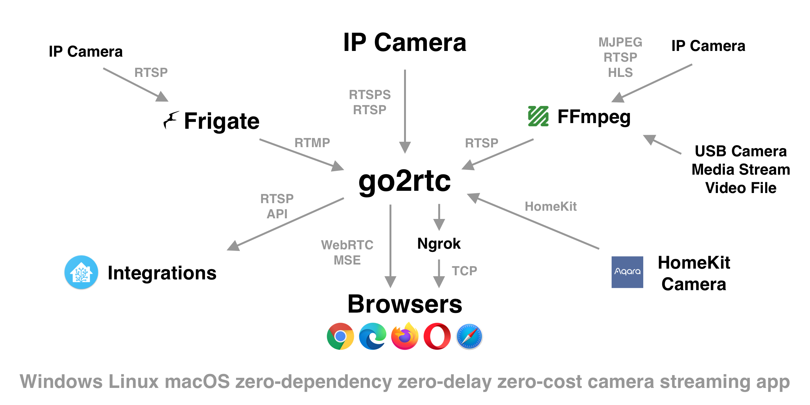

# Frigate 101

> _Preface_: This document is what I would like to have known when I first desired to use Frigate. I created it in order to help me understand what Frigate does and a little of how it does it (I find knowing a bit about the workings of a tool helps me understand how to better wield it, its strengths and limitations). The starting point is "I have some (Reolink) IP surveillance cameras, I'm comfortable in a Linux environment, have used some of the tooling before, e.g. ffmpeg, but know almost nothing about machine vision". This was written ca. mid-2023, Frigate 0.12.

[Frigate](https://frigate.video) is a Network Video Recorder (NVR) "built around real-time AI object detection". In a nutshell, it ingests a huge variety of video streams from cameras and other sources and uses a sophisticated machine vision process to detect objects of interest, raising "events" (e.g. recording video, sending a message to [Home Assistant](https://www.home-assistant.io/)). Frigate is provided as a Linux container and has a mobile-friendly web user interface (UI).

Frigate employs the following pipeline from video in to recordings and/or events out:

1. detect motion to find candidate frames for object detection
    - identify frame-level changes in the incoming video stream (i.e. pixels changing) and consider whether those changes are significant
    - hardware-accelerated video processing is of significant benefit here
2. detect objects within the candidate frames
    - send frames associated with motion to one or more object detectors
    - hardware-accelerated object detection helps here (is essential, practically)
3. decide whether the detected object(s) constitute a detection event
    - if so, trigger an action such as an MQTT notification

Frigate makes heavy use of hardware acceleration: both for video processing and for object detection. The resources required for these tasks are distinct: the hardware required for video processing (GPU) is traditionally quite different to that required for object detection (dedicated [AI accelerator](https://en.wikipedia.org/wiki/AI_accelerator "AI accelerator") [application-specific integrated circuit](https://en.wikipedia.org/wiki/Application-specific_integrated_circuit "Application-specific integrated circuit") (ASIC) such as [Coral](coral.ai/)). In recent times GPUs (including integrated GPUs) have incorporated machine-learning functions; thus a newer GPU may provide both video-processing and object detection hardware acceleration.

## Image Ingestion and Processing

Frigate uses [ffmpeg](https://ffmpeg.org/) and optionally [go2rtc](https://github.com/AlexxIT/go2rtc) to ingest video streams, and by using these very capable tools is able to work with a very wide variety of video codecs and protocols. Once the video is on a workable form, it uses [OpenCV](https://opencv.org/) for processing and manipulation of the image (e.g. motion detection, scaling). (Aside: OpenCV can read video streams - but [is limited](https://github.com/blakeblackshear/frigate/discussions/1260) - and can do object detection, however Frigate doesn't use it for that, [at least at present](https://github.com/blakeblackshear/frigate/issues/2864)).

A lot of Frigate's apparent complexity arises from dealing with the multitude of video formats out there. To minimise the level of ffmpeg specialist knowledge required, Frigate provides a set of "[sensible defaults](https://docs.frigate.video/configuration/ffmpeg_presets)" for almost every facet of reading video in from the network (input), processing it ("hwaccel"), and preparing it to be written to disk and played back later (output).

Frigate is moving to using go2rtc for handling "more complex" video streams	and other related functionality - for example, to provide the live views of the camera in different (more efficient) formats, for transcoding incoming video, and to restream video to Home Assistant (or other applications).

### Motion Detection

The initial motion detection step is required for two main reasons:

- processing limits: current object detection implementations do not come anywhere near being able to handle video directly, they just can't keep up; feeding _only_ the component of the video stream that is known to be of interest (that is, moving) makes the problem tractable today
- improved accuracy: object detection algorithms are not foolproof: by combining motion detection with object detection a more reliable result is achieved. i.e. if something in the image is moving, and that movement "looks like" a particular object, it's overall more likely that the object is of interest in the context of an NVR

Motion is any change from frame to frame; any real-world scene will often have uninteresting objects moving within, for example leaves in a tree, clouds in the sky, a timestamp added by the camera. Frigate supports [masking](https://docs.frigate.video/configuration/masks) off - ignoring - these areas. Excessive masking is detrimental to object detection if it "hides" useful information. It's preferable to minimise masking as much as possible (the compromise being that "motion" due to things other than objects of interest is going to place greater load on detection resources).

Aside: in addition to the motion-detection masking, object filter masks can be applied: these tell Frigate to ignore "impossible" (or uninteresting) object detections. For example an object filter mask can be used define a "sky" area, and filter out any "dog" objects therein. As with motion masks, excessive object masking is detrimental; [zones](https://docs.frigate.video/configuration/zones#restricting-zones-to-specific-objects) should be used to define combinations of objects of interest and areas of interest.

Some kinds of uninteresting motion are impossible to mask out, for example changes in lighting on a surface (e.g. camera exposure changes, particularly to/from day-time colour to night-time infrared).

Frigate provides a very useful "Debug Viewer" that can show the areas of the video stream that "have motion" (rectangles displayed in red).

When an object of interest is moving within an image it is possible that only part of that object is seen to move from frame-to-frame. For example, a person moving slowly towards the camera: the upper body may appear stationary with only the legs or arms moving. The object detection process is more accurate when it has "the whole picture" of the object, so Frigate gathers up related motion areas into a single "area of interest" (region) of the full image to then send for object detection. These regions are always square (per object detection input requirements), and are shown in green in the Debug Viewer.

Frigate also has a tracking algorithm whereby it will use information garnered from the object detection process to inform where it should be "looking" for areas of interest. e.g. if an object moves into a masked area, or if an object detected is reported to extend to the edge of the region, Frigate will expand the region ("zoom out") until the object is fully within the region ([ref](https://docs.frigate.video/configuration/masks)).

Frigate supports multiple regions, i.e. can detect objects in different parts of the same scene.

The end result of the motion stage is a set of regions that may contain objects of interest.

### Stream Resolution and Frame Rate

Perhaps counter-intuitively, Frigate often performs better with lower resolution and frame rate video streams than higher. i.e. camera substreams rather than main streams. Feeding Frigate excessively large and/or high-frame-rate video streams just leads to slower motion detection rates for little useful benefit. There is a trade-off between the greater detail provided in larger video sizes/rates vs. higher throughput and lower susceptibility to "noise" (minute movements) for smaller video sizes. A camera substream of say 0.5MP at 5 fps is significantly less data, and thus faster to process, than a 2/5/8MP main stream at 25 fps. You only need "enough" resolution to confidently detect objects in the image, and the substream would normally suffice.

The Frigate docs provide more guidance here: <https://docs.frigate.video/frigate/camera_setup/#choosing-a-detect-resolution>.

## Object Detection

In the context of machine vision, the goal of object detection is to _locate_ **and** _identify_ objects in an image. Locate means to determine a bounding box of the objects; identify means to classify the located objects.

For surveillance applications it is also useful to _track_ objects: to analyse an object's spatial and temporal features (i.e. recognising that an object is moving in a particular direction). This enables the system to continue to recognise an object even when it momentarily is lost from object detection (e.g. is occluded), to predict where an object may be in future (to improve efficiency of object detection), and persisting object tracking across multiple video streams (e.g. moving from one camera to another).


Various machine learning techniques can be used to achieve object detection and tracking - usually targeted to specific applications (e.g. image classification, semantic segmentation, pose estimation, tracking and so on). A machine learning _algorithm_ generally requires a _model_ - the result of processing training data through some kind of deep learning process, such as a Convolutional Neural Network (CNN) or Recurrent Neural Networks (RNNs), that "learn" features from images that are relevant to object detection, such as the shape, texture, and colour of objects. These models are trained on large datasets of images that have been manually labelled with the objects that they contain.

For example, the [You Only Look Once](https://pjreddie.com/darknet/yolo/) (YOLO) real-time object detection model is trained on the [Common Objects in Context ](https://cocodataset.org/#explore) (COCO) dataset. COCO is a large-scale dataset of images that are annotated with object bounding boxes and labels. COCO is approximately 25GB in size and consists of approx. 330,000 images, 1.5M object instances and over 80 object categories, such as people, animals, vehicles, and furniture. The data set a model is trained on defines the universe of objects that can be detected.

Once a model is trained, it's then used in an "inference" process, where the model is used to make predictions on new data. The inference process typically requires far fewer resources (storage and computational) than the training phase. Frigate calls these "detectors".

Models are often useable across multiple maehine learning (ML) *frameworks*; common ML frameworks include [Tensorflow](https://www.tensorflow.org/) (and [Keras](https://keras.io/)), [PyTorch](https://pytorch.org/), [Caffe](https://caffe.berkeleyvision.org/), and [Coral](https://coral.ai/). Frameworks may be targeted to specific applications, for example Coral is aimed at "local" AI (aka edge devices) and only runs only on specific hardware (Edge TPU devices); however it uses the TensorFlow Lite model that _can_ be used with frameworks that do run on general purpose CPU+GPU platforms (e.g. OpenVINO). The variations of which frameworks are can function, and how they perform, on different hardware can be quite extensive.

Frigate uses the YOLO object detection model, and using various frameworks ('detectors' in Frigate parlance):

- ca. mid 2023, the model is SSDLite MobileDet and MobileNet - in various flavours according to the framework in use: <https://github.com/blakeblackshear/frigate/blob/dev/Dockerfile>
  - both? are trained on the COCO dataset; they vary according to speed
  - MobileDet and MobileNet are different models, the former is "more accurate but slightly slower"
  - unclear why different models are being used

| Framework |  Hardware Dependencies |
| -- | -- |
| 'CPU' | CPU only, no hardware acceleration (slow) |
| EdgeTPU | Google Coral |
| OpenVINO | Intel CPU, GPU and various dedicated coprocessors |
| TensorRT | NVidia GPU |

- "CPU" is presumably TensorFlow Lite ?

Frigate's object detection should in principle provide the same output regardless of framework where the same model is used (? TBC?). In practice, each implementation is slightly different (e.g. numerical representations, e.g. size of a floating point number) and may result in quite different outcomes. Moreover, the model is _not_ exactly the same between frameworks, e.g. "the openvino model is entirely different from the coral model" ([ref](https://github.com/blakeblackshear/frigate/discussions/5844)); presumably this is mobilenet vs mobiledet differences. i.e. YMMV across different frameworks (detectors).

Aside: [Frigate+](https://frigate.video/plus/) is aiming to develop models "trained from scratch and specifically designed for the way Frigate NVR analyzes video footage", and as a paid service to support the free/open Frigate.

Frigate supports multiple object detectors, each run in dedicated processes, pulling from a common queue of detection requests from across all cameras. (Presumably this implies that all detectors should be same type for any hope of consistent detection behaviour.)

The output of the detector is a list of objects: each with a

- bounding box
- label (e.g. "person")
- score (percentage value as to how confident the detection is)
- area (pixel area of the object) (areas are useful for filtering out "impossible" too-big or too-small objects)

## Recording and Events

Frigate keeps track of objects detected in each frame and filters them over a short window (3 frames) to reduce [false positives](https://docs.frigate.video/guides/false_positives/).

TODO: zones

### Recording

Frigate continually saves the incoming video in short (~10s) segments to temporary storage. When an event is detected Frigate copies the relevant segments to persistent storage (Frigate can also write _all_ segments, for continuous recording, or those where motion but no object was detected). This can be on NFS, via an appropriate docker configuration (presumably any [docker volume driver](https://docs.docker.com/storage/volumes/) will work). In this way, recordings are written directly from the camera stream without re-encoding (https://docs.frigate.video/configuration/record/). Frigate manages the persistent storage to retain recordings for as long as desired, based on time and also the nature of the recording (all, motion or moving (active) object).

<https://docs.frigate.video/configuration/record/>

## Frigate Configuration

TODO

### go2rtc

Detecting events is one thing, recording and viewing the resulting video is another.



[go2rtc](https://github.com/AlexxIT/go2rtc) is a separate application, bundled with Frigate, that Frigate uses for handling "more complex" video streams. For example, go2rtc is optionally used to provide the live views of the camera in different (more efficient) formats, for transcoding incoming video, and to restream video to Home Assistant (or other applications). Without go2rtc Frigate will use [jsmpeg](https://jsmpeg.com/) for the [Live View](https://docs.frigate.video/configuration/live/); go2rtc supports WebRTC or MSE for live viewing that can provide higher resolutions and frame rates.

got2rtc has "modules" that define both the input (streams), output, and other functions (logging):

- the `streams` module in turn supports a large number of different source types, such as RTSP, an ffmpeg device (e.g. webcam), local process (`exec`) and so on
- the outputs are all separate modules, and there are output modules for the browser (`api`), RTSP, Home Assistant and more

#### go2rtc Streams

Within a `stream`, each input can define multiple sources, and go2rtc will select the best source for each client (["multi-source 2-way codecs negotiation"](https://github.com/AlexxIT/go2rtc#codecs-negotiation)).

For example, this frigate snippet defines one (input) stream with two sources: `rtsp` and `ffmpeg` (the ffmpeg source in turn refers to the rtsp source)

```frigate
go2rtc:
  rtsp:
    default_query: "video=h264&audio=all"
  streams:
    trackmix_wide:
      - rtsp://192.168.1.31:554/h265Preview_01_main
      - "ffmpeg:trackmix_wide#video=h264#hardware"
```

- one source is as-is from the camera; the second is via ffmpeg, and transcoded to H.264 (with hardware acceleration, required for `h264`)
- it's possible to have multiple disparate sources, for example the Reolink TrackMix camera has two sources: a wide angle (`h265Preview_01_main`) and telephoto (`h265Preview_02_main`); both can only do H.265
  - it probably is simpler to treat these as separate cameras, e.g. `trackmix_wide` and `trackmix_tele` rather than two sources on the same camera (stream)
  - the `rtsp` module's `default_query` tells go2rtc to deliver only the source that matches the `h264` codec; i.e. the above example won't deliver the H.265 source unless the client specifically asks for it
  - if you open the "all" go2rtc stream in VLC by way of the `video=all` argument, (e.g. `rtsp://frigate_ip:8554/trackmix_wide?video=all&audio=all`), you'll be able to select between the two video tracks, one the original H.265 and the other the transcoded H.264
    - had random failures to open the stream and/or change video tracks with VLC 3.0.18 on Apple Silicon, YMMV

##### The FFmpeg Source

syntax: `ffmpeg:{input}#{param1}#{param2}#{param3}`

- where `input` is the name or reference to a stream, file or device

A common use case for the FFmpeg source is to transcode a stream from a camera; in which case it may also be desireable to provide the non-transcoded stream as well. For this, both the camera's stream, e.g. an `rtsp://` URL, and the `ffmpeg` source would be listed within the go2rtc stream. As a convenience the `ffmpeg` source can use the stream name as an input name, to avoid having to repeat URLs.

- TODO: unclear exactly how it matches up the stream name with a source... seems like the first one listed wins; e.g. seems if you add two `rtsp` sources the `ffmpeg` source just picks the first one when using the stream name

e.g. these are equivalent:

```frigate
trackmix_wide:
  - rtsp://192.168.1.31:554/h265Preview_01_main
  - "ffmpeg:trackmix_wide#video=h264#hardware"

trackmix_wide:
  - rtsp://192.168.1.31:554/h265Preview_01_main
  - "ffmpeg:rtsp://192.168.1.31:554/h265Preview_01_main#video=h264#hardware"
```

When multiple sources are available, as in the above examples, things can get confusing (e.g. keeping track of what is transcoded, what is not, etc) - probably simplest to create separate cameras in frigate and be explicit about the codecs.

### Using go2rtc with Frigate

- configure the camera streams in a new `go2rtc` section of Frigate's `config.yml`
  - go2rtc will make each source available at `rtsp://127.0.0.1/<streamname>`
- _replacing_ the `cameras: inputs` URLs to point to the go2rtc output (i.e. 127.0.0.1)
  - for inputs restreamed via go2rtc, the frigate `input_args: preset-rtsp-restream` should be used (it's a slightly simplified version of the `preset-rtsp-generic` preset: [ref gh](https://github.com/blakeblackshear/frigate/blob/9e531b0b5bf34634dc6c44e7eca7e5eaf5a52a25/frigate/ffmpeg_presets.py#L285))
- https://docs.frigate.video/configuration/restream#reduce-connections-to-camera
- "If you are only using the sub steam for detect *and nothing else*, there's no purpose adding it to go2rtc. In the future frigate may offer dynamic stream switching (for example, use sub stream on mobile to reduce bandwidth use) in which case it would need both" (https://github.com/blakeblackshear/frigate/discussions/5947#discussioncomment-5562288)
  - i.e. configure the sub stream under `cameras: inputs` with `detect` role; the main stream in `go2rtc` and the restream of that in `cameras: inputs` with the `record` role

- as of frigate 0.12.1-367d724, attempting to record a H.265 RTSP stream restreamed via go2rtc crashes ffmpeg with various errors: it appears frigate assumes a H.264 stream from go2rtc

- go2rtc only establishes a connection to the source when a client has requested it; except for some connecton types incl. RTSP where it will always stream from that source: https://github.com/AlexxIT/go2rtc#incoming-sources

- go2rtc's UI is available at the Frigate server's `/live/webrtc`, e.g. `http://frigate_ip:5000/live/webrtc`
	- from there, go2rtc's status and various output streams are listed
	- `http://frigate_ip:5000/live/webrtc/api/streams?src=<sourcename>` shows what's going on with each producer and consumer, in good detail

### go2rtc Transcoding

- go2rtc can pass video through ffmpeg for transcoding, etc: <https://github.com/AlexxIT/go2rtc#codecs-filters>
  - as of ~mid-2023, go2rtc _requires_ hardware acceleration for transcoding, however it's disabled by default: if you omit the `#hardware` tag on the encoder you'll get a corrupted (fragmented grey) image: https://github.com/AlexxIT/go2rtc#codecs-filters
  - go2rtc does some limited, "automatic" (audio) transcoding, e.g. PCM or FLAC to MP4, resampling
  - canned ffmpeg configurations, aka presets or "templates", are available for most common codecs: https://github.com/AlexxIT/go2rtc/blob/master/internal/ffmpeg/ffmpeg.go
    - e.g. `h264/vaapi` for H.264 output using the Video Acceleration API (VA-API); though "go2rtc can automatically detect supported hardware acceleration if enabled"
    - go2rtc also supports arbitrary ffmpeg config
    - TODO: unclear if vaapi employs QSV? or need to DIY a config

- transcoding has significant? GPU resource ramifications, even with hardware acceleration:
  - ODROID-H3 with a Reolink Trackmix 3840x2160 / 25 fps H.265 -> H.264: GPU ~30-40% (`intel-gpu-top` reports significantly higher, under the 'Video' engine: ~60-70% ?!)
  - adding another camera (the Trackmix's tele stream) "only" bumped  GPU up by 5-10% (?!)

#### Restreaming

- where a camera's feed needs to be consumed by multiple systems, e.g. Frigate and some other NVR, it is useful to use go2rtc's restreaming feature instead of multiple streams directly from the camera
  - restreaming from Frigate/go2rtc is preferred over direct-to-camera as this reduces camera load and bandwidth, and supports transcoding if necessary
  - go2rtc has a large number of output modules, including WebRTC
